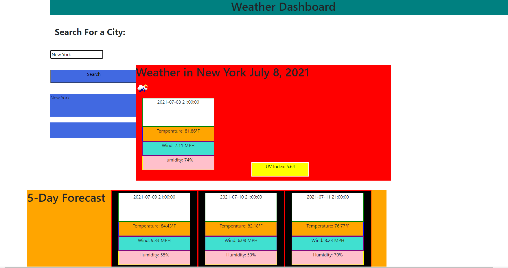

Description: This is my weather app, It takes data from a weather API and allows users to search for weather in whatever city they want. Users will be given the current day forecast, as well as the forecast for the next 5 days. Users can see temperature, UV index, wind speed, humidity, and an icon based on the weather for each day. If the UV index is higher or lower, the UV index field changes color to represent this. 

If users refresh the page, they can search previously searched cities by clicking the button that is displaying the city search history. 

[Link to deployed app](https://maxdamoe.github.io/WeatherApp/)
